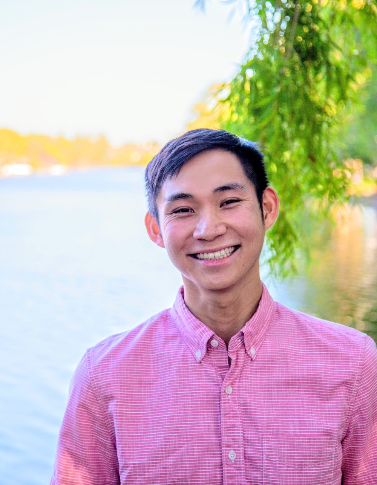

Spunky Alamedan interested in the intersection of tech and social good

Greetings! I'm Raymond, a junior studying Computer Science at Stanford University (Go Trees!!!). I hail from a quaint town in Alameda, California, where I've lived all my life.

I'm a self-proclaimed tech enthusiast, often spending hours watching tech YouTubers review phones/laptops and reading articles 
about the latest and greatest innovations to come out. In my eyes, technology can be the solution to many of the world's problems,
and has the ability to do so much good in the world (if used correctly). I'm particularly interested in discovering how we can leverage
our advances in technical knowledge to help solve real-world issues.

At Stanford, I'm a member of CS+Social Good, a student organization devoted to taking action against the world's pressing problems with 
computer science. This past year, I've been part of the Impact Lab, a subgroup of the club that aims to build a community of undergraduate researchers conducting socially-impactful research. We seek to provide students with faculty mentorship, community, and relevant resources that enable effective social impact-related technical research projects. I find this role especially fulfilling because I'm able to help other students find ways to give meaning to their Stanford experiences.

Me posing outside the Gates CS Building (which has surprisingly terrible Wi-Fi after having spent a summer here :/)

In my free time, I enjoy going on walks with my family, learning new skills (currently learning how to juggle, rock climb, and play the 
guitar), and playing sports (🎾, 🏀, 🏌).